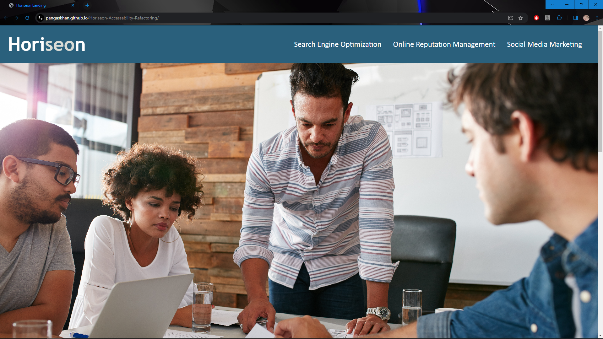

# Horiseon-Accessability-Refactoring

Challenge 1 submission by Connor Ness

Refactoring of HTML page for accessability, with the addition of improved css semantics and comments.

[Link to live page](https://pengaskhan.github.io/Horiseon-Accessability-Refactoring/)

